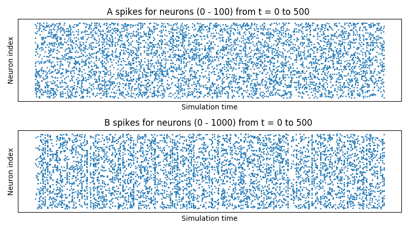
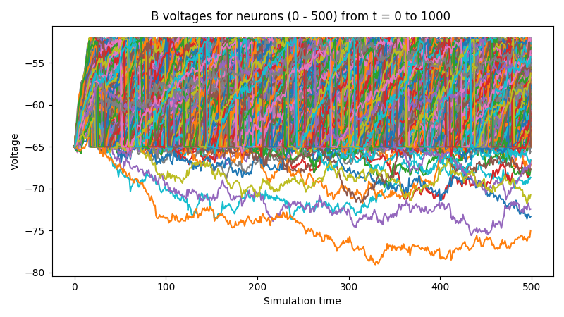

.. _guide_part_i:

Part I: Creating and Adding Network Components
==============================================

Creating a Network
------------------

The :class:`bindsnet.network.Network` object is BindsNET's main offering. It is responsible for the coordination of
simulation of all its constituent components: neurons, synapses, learning rules, etc. To create one:

.. code-block:: python

    from bindsnet.network import Network

    network = Network()

The :py:class:`bindsnet.network.Network` object accepts optional keyword arguments :code:`dt`,
:code:`batch_size`, :code:`learning`, and :code:`reward_fn`.

The :code:`dt` argument specifies the simulation time step, which determines what temporal granularity, in milliseconds,
simulations are solved at. All simulation is done with the Euler method for the sake of computational simplicity. If
instability is encountered in your simulation, use a smaller :code:`dt` to resolve numerical instability.

The :code:`batch_size` argument specifies the expected minibatch size of the input data. However, since BindsNET
supports dynamics minibatch size, this argument can safely be ignored. It is used to initialize stateful neuronal
and synaptic variables, and may provide a small speedup if specified beforehand.

The :code:`learning` argument acts to enable or disable updates to adaptive parameters of network components; e.g.,
synapse weights or adaptive voltage thresholds. See `Using Learning Rules`_ for more details.

The :code:`reward_fn` argument takes in class that specifies how a scalar reward signal will be computed and fed to the
network and its components. Typically, the output of this callable class will be used in certain "reward-modulated", or
"three-factor" learning rules. See `Using Learning Rules`_ for more details.

Adding Network Components
-------------------------

BindsNET supports three categories of network component: *layers* of neurons (:code:`nodes`), *connections* between them
(:py:mod:`bindsnet.network.topology`), and *monitors* for recording the evolution of state variables
(:py:mod:`bindsnet.network.monitors`).

.. note::

    Names of components in a network are arbitrary, and need only be unique within their component group
    (:code:`layers`, :code:`connections`, and :code:`monitors`) in order to address them uniquely. We encourage our
    users to develop their own naming conventions, using whatever works best for them.

Creating and adding layers
**************************

To create a layer (or *population*) of nodes (in this case, leaky integrate-and-fire (LIF) neurons:

.. code-block:: python

    from bindsnet.network.nodes import LIFNodes

    # Create a layer of 100 LIF neurons with shape (10, 10).
    layer = LIFNodes(n=100, shape=(10, 10))

Each :py:mod:`bindsnet.network.nodes` object has many keyword arguments, but one of either :code:`n` (the number of
nodes in the layer, or :code:`shape` (the arrangement of the layer, from which the number of nodes can be computed) is
required. Other arguments for certain nodes objects include :code:`thresh` (scalar or tensor giving voltage threshold(s)
for the layer), :code:`rest` (scalar or tensor giving resting voltage(s) for the layer), :code:`traces` (whether to
keep track of "spike traces" for each neuron in the layer), and :code:`tc_decay` (scalar or tensor giving time
constant(s) of the layer's neurons' voltage decay).

To add a layer to the network, use the :code:`add_layer` function, and give it a name (a string) to call it by:

.. code-block:: python

    network.add_layer(
        layer=layer, name="LIF population"
    )

Such layers are kept in the dictionary attribute :code:`network.layers`, and can be accessed by the user; e.g., by
:code:`network.layers['LIF population']`.

Other layer types include :py:class:`bindsnet.network.nodes.Input` (for user-specified input spikes),
:py:class:`bindsnet.network.nodes.McCullochPitts` (the McCulloch-Pitts neuron model),
:py:class:`bindsnet.network.nodes.AdaptiveLIFNodes` (LIF neurons with adaptive thresholds), and
:py:class:`bindsnet.network.nodes.IzhikevichNodes` (the Izhikevich neuron model). Any number of layers can be
added to the network.

Custom nodes objects can be implemented by sub-classing :py:class:`bindsnet.network.nodes.Nodes`, an abstract class with
common logic for neuron simulation. The functions :code:`forward(self, x: torch.Tensor)` (computes effects of input
data on neuron population; e.g., voltage changes, spike occurrences, etc.), :code:`reset_state_variables(self)` (resets neuron state
variables to default values), and :code:`_compute_decays(self)` must be implemented, as they are included as abstract
functions of :py:class:`bindsnet.network.nodes.Nodes`.

Creating and adding connections
*******************************

Connections can be added between different populations of neurons (a *projection*), or from a population back to itself
(a *recurrent* connection). To create an all-to-all connection:

.. code-block:: python

    from bindsnet.network.nodes import Input, LIFNodes
    from bindsnet.network.topology import Connection

    # Create two populations of neurons, one to act as the "source"
    # population, and the other, the "target population".
    source_layer = Input(n=100)
    target_layer = LIFNodes(n=1000)

    # Connect the two layers.
    connection = Connection(
        source=source_layer, target=target_layer
    )

Like nodes, each connection object has many keyword arguments, but both :code:`source` and :code:`target` are required.
These must be objects that subclass `bindsnet.network.nodes.Nodes`. Other arguments include :code:`w` and :code:`b`
(weight and bias tensors for the connection), :code:`wmin` and :code:`wmax` (minimum and maximum allowable weight
values), :code:`update_rule` (:py:class:`bindsnet.learning.LearningRule`; used for updating connection weights based on
pre- and post-synaptic neuron activity and / or global neuromodulatory signals), and :code:`norm` (a floating point value
to normalize weights by).

To add a connection to the network, use the :code:`add_connection` function, and pass the names given to source and
target populations as :code:`source` and :code:`target` arguments. Make sure that the source and target neurons are
added to the network as well:

.. code-block:: python

    network.add_layer(
        layer=source_layer, name="A"
    )
    network.add_layer(
        layer=target_layer, name="B"
    )
    network.add_connection(
        connection=connection, source="A", target="B"
    )

Connections are kept in the dictionary attribute :code:`network.connections`, and can be accessed by the user; e.g., by
:code:`network.connections['A', 'B']`. The layers must be added to the network with matching names (respectively,
:code:`A` and :code:`B`) in order for the connection to work properly. There are no restrictions on the directionality
of connections; layer "A" may connect to layer "B", and "B" back to "A", or "A" may connect directly back to itself.

Custom connection objects can be implemented by sub-classing :py:class:`bindsnet.network.topology.AbstractConnection`, an
abstract class with common logic for computing synapse outputs and updates. This includes functions :code:`compute` (for computing
input to downstream layer as a function of spikes and connection weights), :code:`update` (for updating connection
weights based on pre-, post-synaptic activity and possibly other signals; e.g., reward prediction error),
:code:`normalize` (for ensuring weights incident to post-synaptic neurons sum to a pre-specified value), and :code:`reset_state_variables`
(for re-initializing stateful variables for the start of a new simulation).

For more complex connections, the MulticompartmentConnection class can be used. The MulticompartmentConnection will pass spikes through different "features"
such as weights, bias's, and boolean masks in a specified order. Features are passed to the MulticompartmentConnection constructor in a list, and executed in order. 
For example, the code below uses a pipeline containing a weight and bias feature. During runtime, spikes from the source will be multiplied by the weights first, 
then a bias added second. Additional features can be added before/after/between these two.
To create a simple all-to-all connection with a weight and bias:

.. code-block:: python

    from bindsnet.network.nodes import Input, LIFNodes
    from bindsnet.network.topology import MulticompartmentConnection
    from bindsnet.network.topology_features import Weight, Bias

    # Create two populations of neurons, one to act as the "source"
    # population, and the other, the "target population".
    source_layer = Input(n=100)
    target_layer = LIFNodes(n=1000)

    # Create 'pipeline' of features that spikes will pass through
    weights = Weight(name='weight_feature', value=torch.rand(100, 1000))
    bias = Bias(name='bias_feature', value=torch.rand(100, 1000))

    # Connect the two layers.
    connection = MulticompartmentConnection(
        source=source_layer, target=target_layer,
        pipeline=[weight, bias]
    )

Specifying monitors
*******************

:py:class:`bindsnet.network.monitors.AbstractMonitor` objects can be used to record tensor-valued variables over the
course of simulation in certain network components. To create a monitor to monitor a single component:

.. code-block:: python

    from bindsnet.network import Network
    from bindsnet.network.nodes import Input, LIFNodes
    from bindsnet.network.topology import Connection
    from bindsnet.network.monitors import Monitor

    network = Network()

    source_layer = Input(n=100)
    target_layer = LIFNodes(n=1000)

    connection = Connection(
        source=source_layer, target=target_layer
    )

    # Create a monitor.
    monitor = Monitor(
        obj=target_layer,
        state_vars=("s", "v"),  # Record spikes and voltages.
        time=500,  # Length of simulation (if known ahead of time).
    )

The user must specify a :code:`Nodes` or :code:`AbstractConnection` object from which to record, attributes of that
object to record (:code:`state_vars`), and, optionally, how many time steps the simulation(s) will last, in order to
save time by pre-allocating memory. 

Monitors are not officially supported for MulticompartmentConnection

To add a monitor to the network (thereby enabling monitoring), use the :code:`add_monitor` function of the
:py:class:`bindsnet.network.Network` class:

.. code-block:: python

    network.add_layer(
        layer=source_layer, name="A"
    )
    network.add_layer(
        layer=target_layer, name="B"
    )
    network.add_connection(
        connection=connection, source="A", target="B"
    )
    network.add_monitor(monitor=monitor, name="B")

The name given to the monitor is not important. It is simply used by the user to select from the monitor objects
controlled by a :code:`Network` instance.

One can get the contents of a monitor by calling :code:`network.monitors[<name>].get(<state_var>)`, where
:code:`<state_var>` is a member of the iterable passed in for the :code:`state_vars` argument. This returns a tensor of
shape :code:`(time, n_1, ..., n_k)`, where :code:`(n_1, ..., n_k)` is the shape of the recorded state variable.

The :py:class:`bindsnet.network.monitors.NetworkMonitor` is used to record from many network components at once. To
create one:

.. code-block:: python

    from bindsnet.network.monitors import NetworkMonitor

    network_monitor = NetworkMonitor(
        network: Network,
        layers: Optional[Iterable[str]],
        connections: Optional[Iterable[Tuple[str, str]]],
        state_vars: Optional[Iterable[str]],
        time: Optional[int],
    )

The user must specify the network to record from, an iterable of names of layers (entries in :code:`network.layers`),
an iterable of 2-tuples referring to connections (entries in :code:`network.connections`), an iterable of tensor-valued
state variables to record during simulation (:code:`state_vars`), and, optionally, how many time steps the simulation(s)
will last, in order to save time by pre-allocating memory.

Similarly, one can get the contents of a network monitor by calling :code:`network.monitors[<name>].get()`. Note this
function takes no arguments; it returns a dictionary mapping network components to a sub-dictionary mapping state
variables to their tensor-valued recording.

Running Simulations
-------------------

After building up a :code:`Network` object, the next step is to run a simulation. Here, the function
:code:`Network.run` comes into play. It takes arguments :code:`inputs` (a dictionary mapping names of
layers subclassing :code:`AbstractInput` to input data of shape :code:`[time, batch_size, *input_shape]`,
where :code:`input_shape` is the shape of the neuron population to which the data is passed), :code:`time`
(the number of simulation timesteps, generally thought of as milliseconds), and a number of keyword
arguments, including :code:`clamp` (and :code:`unclamp`), used to force neurons to spike (or not spike)
at any given time step, :code:`reward`, for supplying to reward-modulated learning rules, and :code:`masks`,
a dictionary mapping connections to boolean tensors specifying which synapses weights to clamp to zero.

Building on the previous parts of this guide, we present a simple end-to-end example of simulating a
two-layer, input-output spiking neural network.

.. code-block:: python

    import torch
    import matplotlib.pyplot as plt
    from bindsnet.network import Network
    from bindsnet.network.nodes import Input, LIFNodes
    from bindsnet.network.topology import Connection
    from bindsnet.network.monitors import Monitor
    from bindsnet.analysis.plotting import plot_spikes, plot_voltages

    # Simulation time.
    time = 500

    # Create the network.
    network = Network()

    # Create and add input, output layers.
    source_layer = Input(n=100)
    target_layer = LIFNodes(n=1000)

    network.add_layer(
        layer=source_layer, name="A"
    )
    network.add_layer(
        layer=target_layer, name="B"
    )

    # Create connection between input and output layers.
    forward_connection = Connection(
        source=source_layer,
        target=target_layer,
        w=0.05 + 0.1 * torch.randn(source_layer.n, target_layer.n),  # Normal(0.05, 0.01) weights.
    )

    network.add_connection(
        connection=forward_connection, source="A", target="B"
    )

    # Create recurrent connection in output layer.
    recurrent_connection = Connection(
        source=target_layer,
        target=target_layer,
        w=0.025 * (torch.eye(target_layer.n) - 1), # Small, inhibitory "competitive" weights.
    )

    network.add_connection(
        connection=recurrent_connection, source="B", target="B"
    )

    # Create and add input and output layer monitors.
    source_monitor = Monitor(
        obj=source_layer,
        state_vars=("s",),  # Record spikes and voltages.
        time=time,  # Length of simulation (if known ahead of time).
    )
    target_monitor = Monitor(
        obj=target_layer,
        state_vars=("s", "v"),  # Record spikes and voltages.
        time=time,  # Length of simulation (if known ahead of time).
    )

    network.add_monitor(monitor=source_monitor, name="A")
    network.add_monitor(monitor=target_monitor, name="B")

    # Create input spike data, where each spike is distributed according to Bernoulli(0.1).
    input_data = torch.bernoulli(0.1 * torch.ones(time, source_layer.n)).byte()
    inputs = {"A": input_data}

    # Simulate network on input data.
    network.run(inputs=inputs, time=time)

    # Retrieve and plot simulation spike, voltage data from monitors.
    spikes = {
        "A": source_monitor.get("s"), "B": target_monitor.get("s")
    }
    voltages = {"B": target_monitor.get("v")}

    plt.ioff()
    plot_spikes(spikes)
    plot_voltages(voltages, plot_type="line")
    plt.show()

This script will result in figures that looks something like this:

Notice that, in the voltages plot, no voltage goes above -52mV, the default threshold of the :code:`LIFNodes` object.
After hitting this point, neurons' voltage is reset to -64mV, which can also be seen in the figure.

Simulation Notes
----------------

The simulation of all network components is *synchronous* (*clock-driven*); i.e., all components are updated at each
time step. Other frameworks use *event-driven* simulation, where spikes can occur at arbitrary times instead of at
regular multiples of :code:`dt`. We chose clock-driven simulation due to ease of implementation and for computational
efficiency considerations.

During a simulation step, input to each layer is computed as the sum of all outputs from layers connecting to it
(weighted by synapse weights) from the *previous* simulation time step (implemented by the :code:`_get_inputs` method
of the :py:class:`bindsnet.network.Network` class). This model allows us to decouple network components and perform
their simulation separately at the temporal granularity of chosen :code:`dt`, interacting only between simulation steps.

This is a strict departure from the computation of *deep neural networks* (DNNs), in which an ordering of layers is
supposed, and layers' activations are computed *in sequence* from the shallowest to the deepest layer in a single time
step, with the exclusion of recurrent layers, whose computations are still ordered in time.
